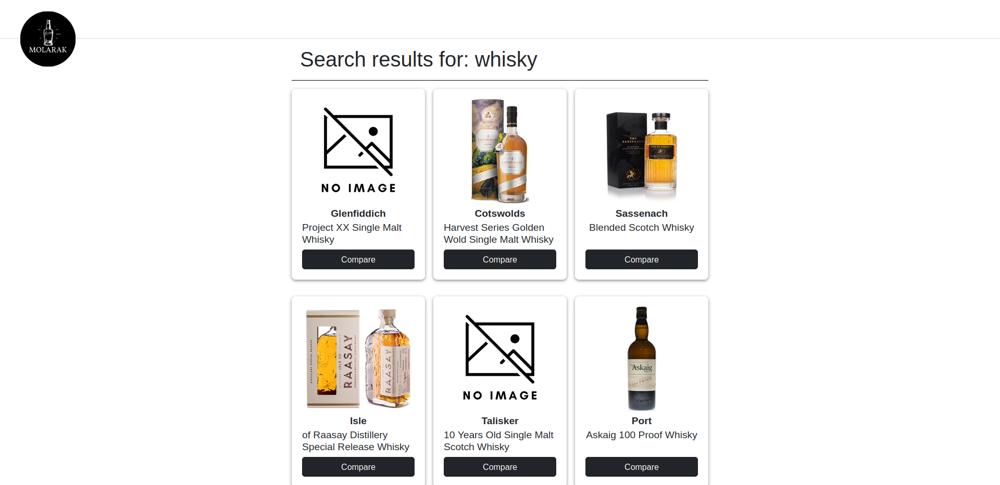

# MoLarak - A Price Comparison Website

MoLarak is a minimalist website for finding the best deals of alcoholic beverages by comparing across various websites.



## Web Scraper

### Technologies

- Java Development Kit 17
- Maven, MySQL, Selenium, Hibernate and Spring
- Google Chrome & Chrome Driver `118.0.5993.70`

### Project Setup

Install JDK

```bash
sudo apt-get install default-jdk
```

Install Maven

```bash
sudo apt-get install maven
```

#### Google Chrome & Chrome Driver

Chrome driver is `required` for Selenium to work. Download the driver from <https://chromedriver.chromium.org/downloads> and place it in `/usr/bin/` directory.

To prevent any errors, make sure that the version of Chrome driver is the same as the version of Google Chrome installed on your system.

Selenium was `not compatile` with the latest stable version of Google Chrome at the time of development, so the version `118.0.5993.70` was used.

Older Google Chrome versions can be downloaded from `https://googlechromelabs.github.io/chrome-for-testing/known-good-versions-with-downloads.json` and shall be placed in the project `scraper` directory.

If Google Chrome is placed in a different directory than `scraper`, modify the `ChromeOptions.options.setBinary()` method in all website scrapers in `scraper/src/main/java/mu/dl661/cst3130/scraper` accordingly.

Reference:  <https://www.youtube.com/watch?v=OlMX0gxyL58>

#### MySQL Database

Install `mysql-server` and configure it using some online documentation like from Digital Ocean.

Create a database named `molarak` and import the dump file `dump_molarak.sql` in it.

```bash
sudo mysql molarak < dump_molarak.sql
```

Export a new dump file

```bash
sudo mysqldump -u root -p molarak > dump_molarak.sql
```

#### Hibernate Configuration

In this project, we have bootstrap Hibernate with Spring using Java Configuration (no XML). The configuration file is `scraper/src/main/java/mu/dl661/cst3130/scraper/config/HibernateConfig.java`. 

Make a copy of the file `scraper/src/main/java/mu/dl661/cst3130/resources/application.properties.example`, rename it to `application.properties` and modify the database root and password accordingly.

### Usage

Build project

```bash
mvn package
```

Run project

```bash
java -jar target/molarak-1.0-jar-with-dependencies.jar
```

Create JDOC

```bash
mvn javadoc:javadoc
```

or

```bash
mvn site
```

## Website

### Technologies

- HTML, CSS, Javascript & Vue 3
- Node.js & Express.js
- MySQL

## Frontend

### Project setup

```bash
npm install
```

#### Compiles and hot-reloads for development

```bash
npm run serve
```

#### Compiles and minifies for production

```bash
npm run build
```

#### Lints and fixes files

```bash
npm run lint
```

### Backend

#### Run backend server

Create .env file in `website/backend/` directory and add the following

```bash
MYSQL_HOST = "localhost"
MYSQL_USER = ""
MYSQL_PASSWORD = ""
MYSQL_DATABASE = "molarak"
```

Navigate to `website/backend/src` directory and run

```bash
npm run dev
```

## Future Work

- Java unit testing with JUnit
- JavaScript unit testing with Mocha/Chai or similar
framework
